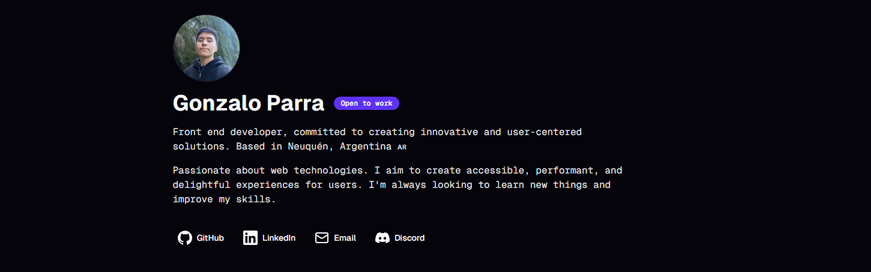

<h1 align="center">Welcome to my Portfolio 🫡</h1>

<div align="center">

</div>

## 🧉 About

A developer portfolio designed to showcase projects, experience and skills that I achieved during my career.

## 🚀 Installation and Usage

To get started on this project you need to follow the next steps:

```bash
git clone https://github.com/gonzalojparra/portfolio
# First clone the repo in your folder of choice.
cd portfolio
# Move into the recently cloned repo.
npm install
# Install dependencies using npm or your favourite package manager.
npm run dev
# Run the development server of the project.
```

## 💻 Technologies

The project is being developed with the following tech-stack:

- Next.js
- TypeScript
- TailwindCSS
- Shadcn/ui
- Resend
- And more

## Author

**Gonzalo Parra**

- Website: https://portfolio-gonzalojparra.vercel.app/
- GitHub: [@gonzalojparra](https://github.com/gonzalojparra)
- LinkedIn: [@gonzalojparra](https://www.linkedin.com/in/gonzalojparra/)
